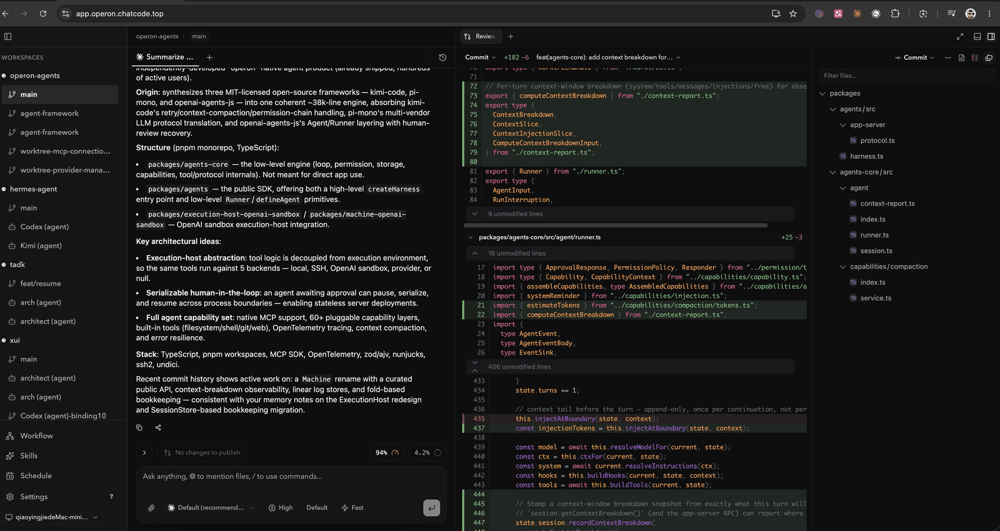
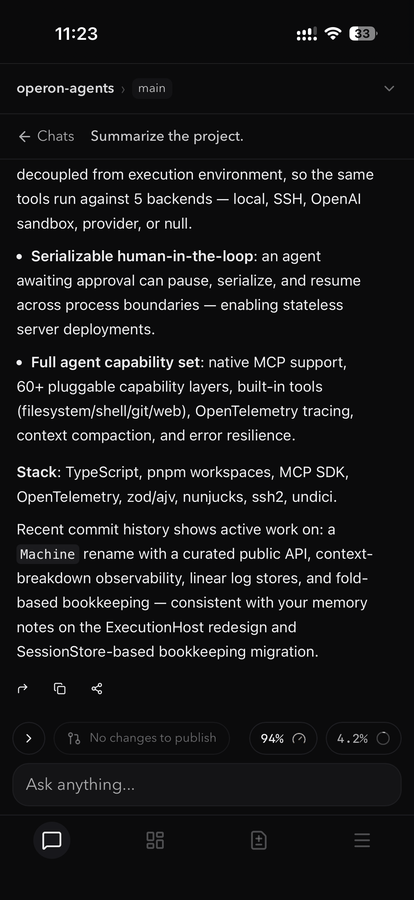

<p align="center">
  
</p>

<p align="center">
  <a href="https://github.com/Nickqiaoo/Operon/releases/latest"></a>
  <a href="https://github.com/Nickqiaoo/Operon/releases"></a>
  
  
  
</p>

---

A desktop UI for AI coding agents that isn't tied to any one of them.

Operon gives Claude Code, Codex, Gemini CLI, Copilot CLI and others a proper
window — tabs, per-turn diff review, a file tree, a real editor — and lets
several of them work on the same repository **together**.

It drives the official CLIs on your machine. You use whichever subscriptions you
already pay for; Operon does not resell model access, and agent execution stays
on your machine. When you connect from the web or a mobile app, remote request
and response content is end-to-end encrypted between the approved device and
your desktop.

## Download

**Desktop — macOS** (Apple Silicon & Intel), from the
[latest release](https://github.com/Nickqiaoo/Operon/releases/latest). Windows and
Linux are not available.

**Mobile** — the agent keeps running on your Mac, and the phone reaches the same
session — approve a diff or steer a run from anywhere.

- **iOS** — on the App Store:

  <a href="https://apps.apple.com/us/app/operon-ai/id6797370866"></a>

- **Android** — a signed APK from [operon.chatcode.top](https://operon.chatcode.top)

There is also a web client and Telegram and Slack bridges if you'd rather not
install anything.

<p align="center">
  
  
</p>

<p align="center">
  <sub>The same session in a browser and on a phone. The agent keeps running on your Mac.</sub>
</p>

## Multiple agents, working together

This is the part Operon is built around, rather than being a single-agent
wrapper with extra tabs.

- **Multi-agent threads** — pull two or more agents into one conversation and let
  them disagree about an approach. You moderate and decide.
- **Canvas workflows** — describe a pipeline in plain text, no code or config. A
  node starts the moment *its own* inputs are ready, not when the whole stage
  finishes, so independent branches genuinely run in parallel. Reference any
  upstream output with `{{nodeName}}`.
- **Isolated worktrees** — dispatched tasks each land in their own git worktree,
  so parallel agents never step on each other. Inspect exactly which files came
  back changed.
- **Delegation** — one agent can hand work to others, which run in background
  tabs without blocking the conversation you're in.
- **Spec-driven changes** — spec, plan and acceptance each get a human sign-off
  before work moves on, and an independent verifier agent can check the result
  before you approve it.

## Also in the app

- **Per-turn diff review** — every turn pins exactly the files it touched, so you
  read the change before it goes near a commit
- **Live context & usage tracking** — see the context window filling up while the
  agent works
- **Skills** — pluggable instruction packs, installable globally or per project
- **Long-term memory** — local hybrid vector + keyword search, so preferences and
  project facts survive across sessions
- **MCP servers** — connect any Model Context Protocol server (stdio / HTTP / SSE)
- **Browser & Computer Use** — the agent can drive a built-in browser, your own
  Chrome via an extension, or operate native macOS apps
- **Cron jobs** — schedule recurring prompts or whole workflows
- **Integrated terminal** — full PTY inside the app
- **Auto-update**

## Supported agents

Claude Code · Codex · Gemini CLI · GitHub Copilot CLI · Cursor Agent · Kimi ·
Grok · OpenCode · any custom agent speaking ACP

Bring your own subscription or API key for whichever you use.

## Documentation

Full documentation is at **[operon.chatcode.top/docs](https://operon.chatcode.top/docs)**.

- [Getting Started](https://operon.chatcode.top/docs/getting-started) — installation, first workspace, connecting agents
- [Chat](https://operon.chatcode.top/docs/chat) — multi-agent chat, streaming, tool execution, attachments, session resume
- [Canvas Workflows](https://operon.chatcode.top/docs/workflow) — visual DAG editor, node types, template variables, execution monitoring
- [Skills](https://operon.chatcode.top/docs/skills) — browse, install, and create skill packs
- [MCP Servers](https://operon.chatcode.top/docs/mcp-servers) — stdio, HTTP, and SSE servers
- [Memory](https://operon.chatcode.top/docs/memory) — vector, keyword, and hybrid retrieval
- [Cron Jobs](https://operon.chatcode.top/docs/cronjob) — scheduled prompts and workflows
- [External Agents](https://operon.chatcode.top/docs/external-agents) — delegation and orchestration

## Build from source

Requires macOS, Node 22 or newer, and the Xcode command line tools.

```bash
npm install
npm run dev            # desktop app in development
npm test               # unit tests
npm run build:mac      # signed .dmg (needs Apple credentials in .env)
```

Two native components build separately and are optional in development:

```bash
cd native/computer-use && swift build    # the Computer Use engine
npm run build:computer-use-native        # native addons, including peer-auth
```

Native modules are built against Electron's ABI for the app and Node's for the
test runner. If a test fails to load one, run `npm run rebuild:native:node`;
before running the app again, `npm run rebuild:native`.

The web and mobile clients share one bundle:

```bash
npm run dev:web        # web client in development
npm run ios:sync       # build and sync into the iOS project
npm run android:sync   # build and sync into the Android project
```

## Repository layout

```
src/                 Desktop and web UI (React). The web build is the same code.
server/              Local backend: agents, memory, tasks, channels, git, MCP.
                     Runs inside the Electron main process.
agent-runtime/       Provider implementations. One directory per agent.
packages/
  browser-use/       Browser control: the wire protocol, the in-app browser
                     backend, and the SDK the model drives it with.
  computer-use/      The node_repl runtime: a persistent JS session with a
                     privileged surface, plus the macOS Computer Use client.
  site-adapters/     Deterministic commands for specific sites.
  chrome-extension/  The extension that lets an agent drive your own Chrome.
electron/            Electron main process, and the only place that touches it.
native/
  computer-use/      Swift accessibility and input engine.
  peer-auth/         Code-signature verification for local socket peers.
broker/              Go relay between remote clients and paired machines.
tunnel-agent/        The on-machine peer of the broker.
web/                 Landing page and documentation site.
ios/ android/        Capacitor shells around the web bundle.
```

### How the remote path works

```
phone or browser  ->  broker (relay)  ->  tunnel-agent  ->  your desktop
```

The broker forwards bytes. It runs no application logic and does not hold the
content-encryption keys, so a compromised relay learns nothing about your code.

## Contributing

Issues and pull requests are welcome. A few things worth knowing before a larger
change:

- `tsc --noEmit` only covers `src`, `electron` and `shared`. For `server`,
  `agent-runtime` and `packages`, the tests are the type check that matters.
- Some suites drive a real headless Chrome and exclude each other through a
  cross-process lock. Run them with `npx vitest run packages/browser-use`.
- The two packages under `packages/` carry long comments explaining why a piece
  of protocol looks the way it does. They are usually load-bearing; read one
  before changing the code under it.

Found a bug or have a feature request?
[Open an issue](https://github.com/Nickqiaoo/Operon/issues).

## Related repositories

| Component | What it does | License |
|---|---|---|
| [operon-agents](https://www.npmjs.com/package/operon-agents) | The agent framework Operon builds on | MIT |
| [operon-diff-worker](https://github.com/Nickqiaoo/operon-diff-worker) | Cloudflare Worker that renders diffs | Apache-2.0 |

## License

[AGPL-3.0](LICENSE).

If you run a modified Operon as a network service, the same licence requires you
to offer your users its source. Running it on your own machine, modified or not,
carries no such obligation.
